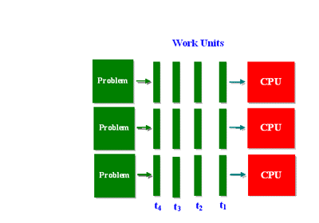
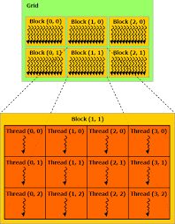

# **Parallel/Distributed Computing** #

  

  

## Description: ##
This repository consists of a few programs that deal with heavy computation by using parallel computing means:
1. exe1 presents the static\dynamic methods of parallel computing, using MPI.
2. exe2 presents other functions from the MPI, and the 2D arrangement of processes to implement the Shearsort Algorithm.
3. The SequenceAlignment project is the final project of the Parallel Distributed Computing course.

## Technologies ##
1. MPI.
2. OpenMP.
3. CUDA development.

For more information, please visit the attached assignment pdf files within each of the project directories.