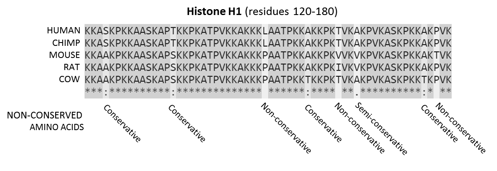

# **SequenceAlignment** #

  

## Description: ##
Given strings and weights, the program calculates the optimal alignment score between two strings and returns the relevant information:
1. Optimal Offset - the distance from the beginning of the long string to where the short one begins. The optimal offset is the one that together with the optimal mutation, yields the best similarity score against.
2. Optimal Mutation - the index of the char '-' in the short string that together with the optimal offset, yields the best similarity score against the long string.
The calculations are heavy, thus they are made by the tools specified in the requirements below, that allow work division into different processes/hosts, and host/device threads.

## Requirements: ##
Please make sure that the following requirements are satisfied in your host:
1. MPI.
2. OpenMP.
3. CUDA development.

## Instructions: ##
1. To compile execute: make
2. To run on one computer execute: make run
3. To run on two computers make the Address file include both ip addresses and execute: make runparallel

For more information, please visit the attached assignment pdf file.